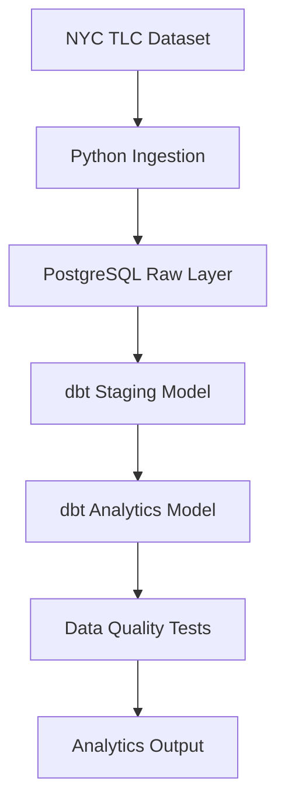
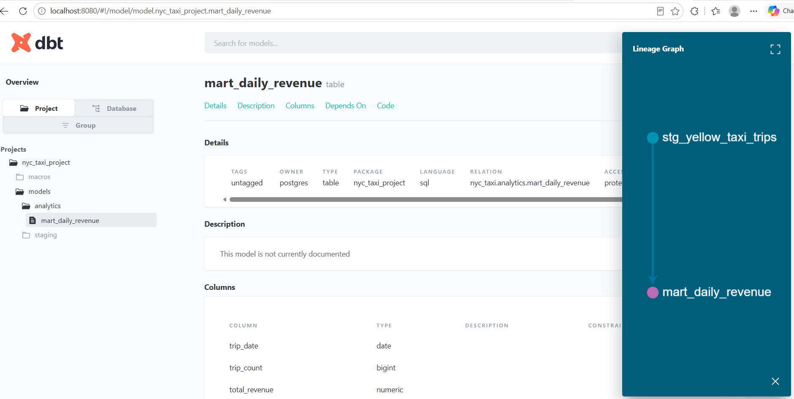

# NYC Taxi ETL Pipeline 🚕

## 📌 Overview

This project is an end-to-end data engineering pipeline built using publicly available NYC Taxi data. It demonstrates ingestion, storage, transformation, and data quality validation using modern data tools.

The pipeline extracts raw data, loads it into a PostgreSQL warehouse, transforms it using dbt into structured layers (staging and analytics), and enforces data quality through automated tests.

---

## 🧭 Architecture (Visual)



## 📸 dbt Lineage



## 🛠️ Tech Stack

* Python
* PostgreSQL
* dbt (data build tool)
* Docker
* Pandas
* SQLAlchemy

---

## ⚙️ Features

* Data ingestion from NYC Taxi dataset (Parquet format)
* Structured data warehouse design (raw, staging, analytics)
* dbt transformations using modular SQL models
* Data quality validation using dbt tests
* Fully containerized environment using Docker

---

## 🚀 How to Run

### 1. Start Docker

```
docker compose up -d
```

### 2. Run ingestion

```
python -m ingestion.extract_tlc_data
python -m ingestion.load_to_postgres
```

### 3. Run data quality checks

```
python -m ingestion.quality_checks
```

### 4. Run dbt models

```
.\venv\Scripts\dbt.exe run --profiles-dir .\dbt\nyc_taxi_project --project-dir .\dbt\nyc_taxi_project
```

### 5. Run dbt tests

```
.\venv\Scripts\dbt.exe test --profiles-dir .\dbt\nyc_taxi_project --project-dir .\dbt\nyc_taxi_project
```

---

## 📊 Data Models

### Staging Layer

* Cleans and standardizes raw taxi trip data

### Analytics Layer

* `mart_daily_revenue`: Aggregated daily metrics including:

  * trip count
  * total revenue
  * average fare
  * average distance

---

## 🧪 Data Quality

* Non-null constraints on timestamps
* Additional validation tests in dbt

---

## 📦 Future Improvements

* Add Airflow orchestration
* Implement incremental models in dbt
* Deploy pipeline to cloud (Azure/GCP)
* Add dashboarding (Metabase or Superset)

---

## 👨‍💻 Author

Built as part of a data engineering portfolio project.
